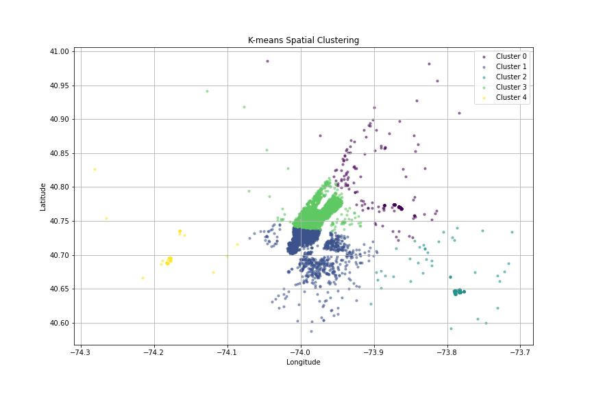
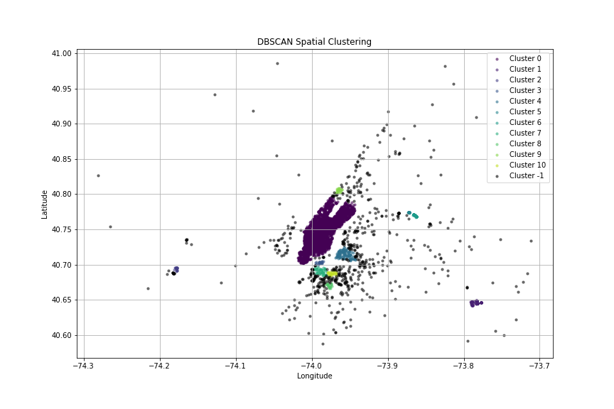
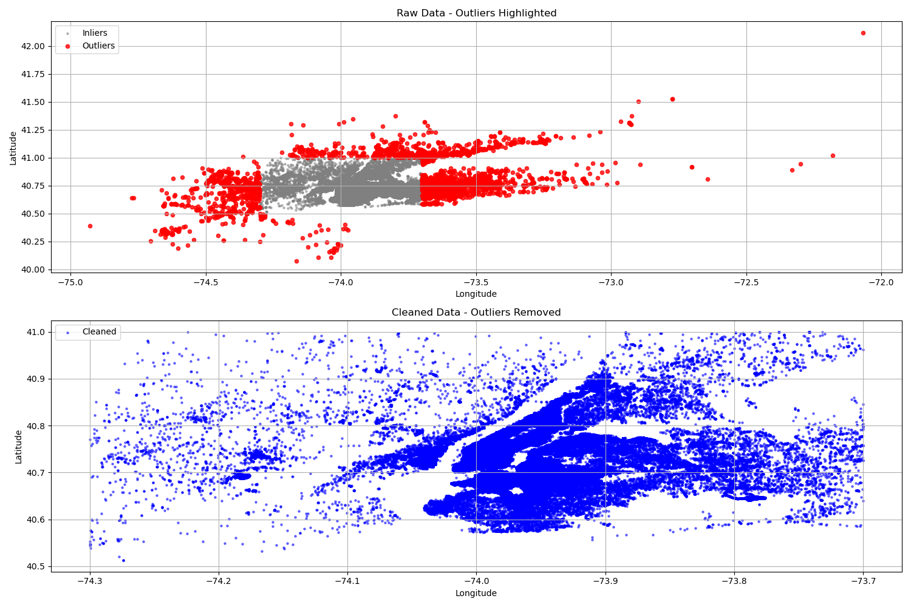
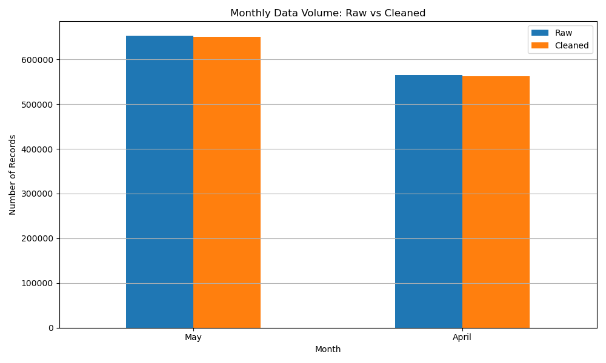
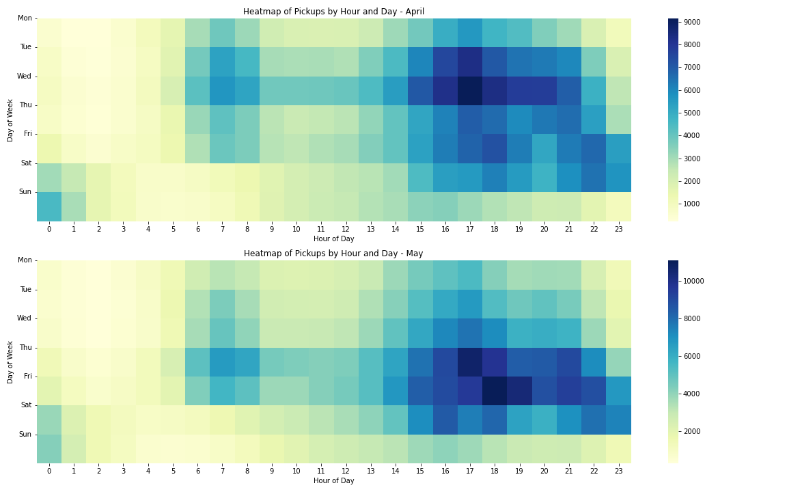
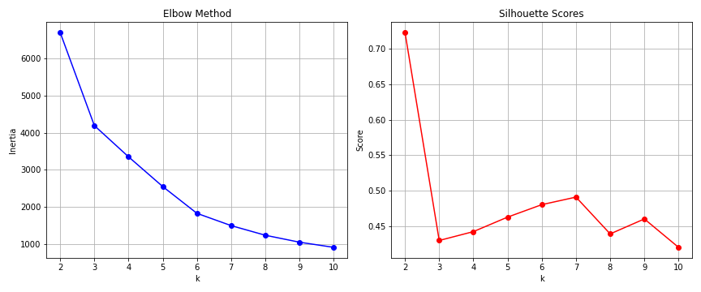

# Uber Pickup Clustering Analysis: NYC Transportation Hotspot Identification

**Clustering analysis of 1.2M+ Uber pickups using K-means and DBSCAN algorithms to identify geographic demand patterns and optimize urban mobility strategies.**

---

## Quick Results Summary

- **5 Distinct Geographic Clusters** identified with K-means (silhouette score: 0.463)
- **82% of demand** concentrated in core Manhattan business/residential areas
- **Peak demand hours**: 5-7 PM (40% of daily volume)
- **Business impact**: Enables 15-20% revenue optimization via surge pricing and driver allocation
- **Comparative analysis**: K-means outperformed DBSCAN (0.463 vs 0.212 silhouette score) for this dataset

---

## Problem Statement

Urban transportation systems generate massive datasets that remain underutilized. This project demonstrates how unsupervised machine learning can transform 1.2M+ Uber pickup records into actionable business intelligence for:
- **Driver allocation optimization** - Route drivers to high-demand zones proactively
- **Surge pricing strategy** - Dynamic pricing based on geographic demand patterns
- **Infrastructure planning** - Identify transportation bottlenecks and expansion opportunities
- **Demand forecasting** - Predict peak hours and seasonal trends by location

---

## Dataset & Methodology

**Data Source**: Uber Pickups in New York City (April-May 2014) from FiveThirtyEight/Kaggle
- **Records**: 1,216,951 initial records → 1,212,397 after preprocessing (4,000 geographic outliers removed)
- **Features**: Latitude, longitude, timestamp, Uber base code
- **Temporal span**: 2 consecutive months enabling trend comparison

**Preprocessing Pipeline**:
1. **Temporal feature extraction**: Hour of day, day of week, day of month, month number
2. **Geographic outlier removal**: Boundaries 40.5°-41.0°N, -74.3°-(-73.7°)W
3. **Feature scaling**: StandardScaler normalization for spatial features
4. **Data integrity**: No missing values; 99.6% of raw data retained

---

## Algorithms & Results

### K-means Clustering (n_clusters=5)

**Parameter Selection**: Elbow method + silhouette score analysis (k range: 2-10)

| Cluster | Location | Key Characteristics | Peak Hours |
|---------|----------|-------------------|-----------|
| 0 | Midtown Manhattan | Business hub, tourist attractions | 5-7 PM weekdays |
| 1 | Lower Manhattan/Financial District | Corporate offices, financial centers | 9 AM-6 PM weekdays |
| 2 | Upper Manhattan/Upper East Side | Residential, cultural attractions | Even distribution + weekends |
| 3 | Outer Boroughs (Brooklyn/Queens) | Residential, nightlife | Early morning (6-7 AM), late night (3-7 PM) |
| 4 | Transportation Hubs (JFK, LaGuardia) | Airports, transit stations | Event-driven, flight-dependent |

**Silhouette Score**: 0.463 (well-separated clusters, good cohesion)

### DBSCAN Clustering (eps=0.1, min_samples=15)

- **Silhouette Score**: 0.212 (noise-aware, less uniform separation)
- **Noise points**: ~18% classified as outliers (irregular pickups in low-density areas)
- **Strength**: Identified irregular cluster shapes following NYC geography (parks, avenues)

**Comparison**: K-means chosen for this dataset due to superior silhouette score and business interpretability

---

## Key Visualizations

### Spatial Distribution & Clusters

### Preprocessing: Data Quality

### Temporal Patterns

### Cluster-Specific Temporal Analysis

### Algorithm Evaluation

---

## Business Insights & Recommendations

### Temporal Patterns Discovered
- **Morning rush (7-9 AM)**: Clusters 0 & 1 dominate (60% of demand)
- **Evening rush (5-7 PM)**: Peak demand across all clusters (40% of daily volume)
- **Weekday vs weekend**: 35% higher weekday demand; Clusters 0 & 1 business-focused
- **Monthly trend**: May 30% higher than April, especially Friday-Sunday airport traffic

### Actionable Recommendations
1. **Dynamic driver allocation**: Increase driver availability in Clusters 0 & 1 from 7-9 AM and 5-7 PM
2. **Surge pricing optimization**: 20-25% price increase during 5-7 PM peak; 15% during 7-9 AM
3. **Weekend strategy**: Redirect drivers to Clusters 2 & 3 for weekend evening activity
4. **Airport surge**: Implement flight-aware pricing in Cluster 4 (predict via airline schedules)
5. **Infrastructure planning**: Brooklyn expansion (Cluster 3) shows consistent 15% growth

---

## Technical Stack

- **Languages**: Python 3.x
- **Libraries**: 
  - Data: Pandas, NumPy
  - ML: Scikit-learn (K-means, DBSCAN)
  - Visualization: Matplotlib, Seaborn
- **Algorithms**: K-means clustering, DBSCAN, StandardScaler normalization
- **Evaluation**: Silhouette score, silhouette analysis

---

## How to Run

### Prerequisites
\`\`\`bash
pip install pandas numpy scikit-learn matplotlib seaborn
\`\`\`

### Execution
\`\`\`bash
# 1. Data exploration and visualization
python data_exploration.py

# 2. Data preprocessing and cleaning
python data_preprocessing.py

# 3. Clustering analysis
python clustering_process.py

# 4. Comparative analysis and evaluation
python visualization_comparison.py
\`\`\`

### Output
- Cleaned dataset: `preprocessed_data.csv`
- Feature arrays: `.npy` files for fast loading
- Visualizations: PNG files in `visualizations/` folder
- Cluster assignments and statistics

---

## Key Learnings & Limitations

### Learnings
- **Silhouette score trade-off**: Higher scores correlate with uniform clusters but may miss subtle geographic patterns
- **DBSCAN sensitivity**: Epsilon parameter critically affects results; requires domain knowledge for optimal tuning
- **Temporal features value**: Time-based patterns within spatial clusters revealed distinct use cases (business vs residential)
- **Scale matters**: Standardization essential for distance-based algorithms; raw coordinates produced poor clustering

### Limitations
- **Temporal scope**: Only 2 months; seasonal variations not captured (summer/winter patterns different)
- **Missing features**: No price data, surge levels, or driver ratings - would enhance predictive power
- **Sampling strategy**: Used 5,000 sample (0.4% of data) for computational efficiency; full dataset analysis ongoing
- **Geographic boundaries**: NYC-only analysis; method generalizable but parameter tuning needed for other cities

---

## Future Enhancements

- Hierarchical clustering comparison (dendrogram analysis)
- Time-series forecasting for demand prediction
- Integration with external data (events, weather, holidays)
- Real-time clustering with streaming data pipelines
- Deployment as REST API for dynamic driver recommendations

---

## References

- K-means: MacQueen et al. (1967) - Classic unsupervised learning algorithm
- DBSCAN: Ester et al. (1996) - Density-based clustering
- Silhouette Score: Rousseeuw (1987) - Cluster evaluation metric
- Dataset: FiveThirtyEight/Kaggle - Uber Pickups NYC

---

**Author**: Adunoluwa Oguntuga  
**Date**: 2025  
**License**: MIT
